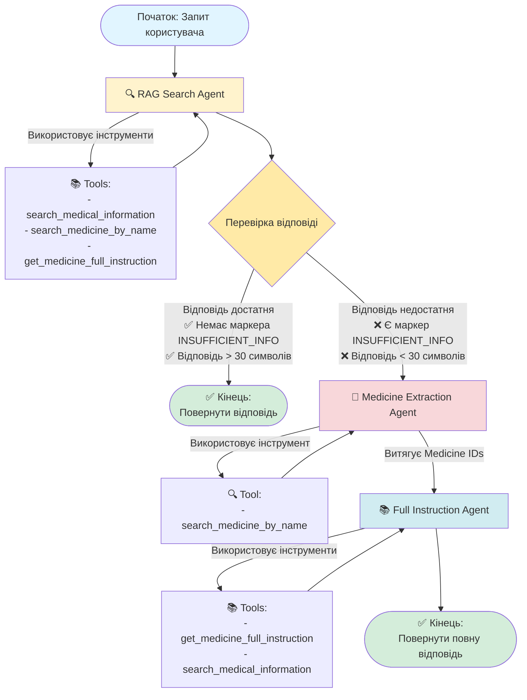

# Граф переходів мульти-агентної системи

## Візуалізація графа



## Детальний опис процесу

### 1. 🔍 RAG Search Agent (Початковий агент)

**Вхід:**
- `query`: Запит користувача
- `response_language`: Мова відповіді (English/Ukrainian)

**Процес:**
1. Агент отримує запит користувача
2. Використовує інструменти для пошуку інформації:
   - `search_medical_information`: Семантичний пошук у базі інструкцій
   - `search_medicine_by_name`: Пошук препаратів за назвою
   - `get_medicine_full_instruction`: Отримання повних інструкцій
3. Аналізує знайдену інформацію
4. Генерує відповідь на основі знайдених даних

**Вихід:**
- `answer`: Відповідь агента
- `sources`: Список джерел (файли, chunk IDs)
- `tools_used`: Список використаних інструментів

**Умова переходу:**
- Якщо агент не знайшов достатньо інформації, він додає маркер `[[INSUFFICIENT_INFO]]` до відповіді
- Або якщо відповідь дуже коротка (< 30 символів), система вважає її недостатньою

---

### 2. 🔀 Умовний перехід (Routing Decision)

**Функція:** `should_continue_to_medicine_search()`

**Перевірки:**
1. **Маркер недостатності інформації:**
   - Перевіряє наявність `[[INSUFFICIENT_INFO]]` у відповіді
   - Це мовонезалежний маркер, який агент явно додає

2. **Довжина відповіді:**
   - Якщо відповідь < 30 символів, вважається недостатньою
   - Це резервна перевірка на випадок, якщо агент не додав маркер

**Результат:**
- ✅ **"end"** - якщо відповідь достатня → завершити обробку
- ➡️ **"extract_medicines"** - якщо відповідь недостатня → перейти до витягування назв препаратів

---

### 3. 💊 Medicine Extraction Agent (Агент витягування назв препаратів)

**Вхід:**
- `query`: Оригінальний запит користувача
- `sources`: Джерела з попереднього агента (якщо є)

**Процес:**
1. Аналізує запит користувача
2. Витягує назви препаратів з запиту
3. Використовує інструмент:
   - `search_medicine_by_name`: Пошук препаратів у базі за назвами
4. Знаходить відповідні Medicine IDs (32-символьні hex-рядки)
5. Повертає список Medicine IDs

**Вихід:**
- `medicine_ids`: Список знайдених Medicine IDs (наприклад: `["A1B2C3D4...", "E5F6G7H8..."]`)
- `sources`: Оновлений список джерел (додаються знайдені препарати)

**Особливості:**
- Може знайти кілька препаратів, якщо вони згадані в запиті
- Використовує регулярні вирази для витягування Medicine IDs з відповіді агента

---

### 4. 📚 Full Instruction Agent (Агент повних інструкцій)

**Вхід:**
- `query`: Оригінальний запит користувача
- `medicine_ids`: Список Medicine IDs від попереднього агента
- `response_language`: Мова відповіді
- `sources`: Джерела з попередніх агентів

**Процес:**
1. Отримує список Medicine IDs
2. Для кожного Medicine ID використовує інструмент:
   - `get_medicine_full_instruction`: Отримує всі chunks інструкції для препарату
3. Аналізує повні інструкції для всіх знайдених препаратів
4. Генерує комплексну відповідь на основі повних інструкцій
5. Відповідає мовою, вказаною в `response_language`

**Вихід:**
- `answer`: Повна відповідь на основі всіх інструкцій
- `sources`: Повний список джерел з усіх chunks
- `tools_used`: Список використаних інструментів

**Особливості:**
- Може обробляти кілька препаратів одночасно
- Отримує до 20 chunks на препарат (обмеження для запобігання переповнення контексту)
- Кожен chunk обрізається до 2000 символів для економії токенів

---

## Стан системи (AgentState)

Система передає стан між агентами через об'єкт `AgentState`:

```python
{
    "query": str,              # Оригінальний запит користувача
    "answer": str,            # Поточна відповідь
    "medicine_ids": list[str], # Список знайдених Medicine IDs
    "agent_used": str,        # Назва останнього використаного агента
    "response_language": str,  # Мова відповіді (English/Ukrainian)
    "error": str,             # Помилка (якщо є)
    "sources": list[dict],     # Список джерел з метаданими
    "tools_used": list[str]    # Список використаних інструментів
}
```

---

## Приклади сценаріїв

### Сценарій 1: Успішний пошук у RAG
```
Запит: "Які побічні дії у парацетамолу?"
  ↓
RAG Search Agent → знаходить інформацію → генерує відповідь
  ↓
Перевірка: відповідь достатня (немає маркера, > 30 символів)
  ↓
✅ Кінець: повертає відповідь користувачу
```

### Сценарій 2: Недостатня інформація → витягування препарату
```
Запит: "Що таке ТИРОКСИН?"
  ↓
RAG Search Agent → не знаходить достатньо інформації → додає [[INSUFFICIENT_INFO]]
  ↓
Перевірка: відповідь недостатня (є маркер)
  ↓
Medicine Extraction Agent → витягує "ТИРОКСИН" → знаходить Medicine ID
  ↓
Full Instruction Agent → отримує повну інструкцію → генерує відповідь
  ↓
✅ Кінець: повертає повну відповідь на основі інструкції
```

### Сценарій 3: Кілька препаратів
```
Запит: "Порівняй ТИРОКСИН та Л-ТИРОКСИН"
  ↓
RAG Search Agent → не знаходить достатньо інформації
  ↓
Medicine Extraction Agent → знаходить обидва препарати → повертає 2 Medicine IDs
  ↓
Full Instruction Agent → отримує інструкції для обох → порівнює та генерує відповідь
  ↓
✅ Кінець: повертає порівняльну відповідь
```

---

## Інструменти (Tools)

### 1. search_medical_information
- **Опис:** Семантичний пошук у базі медичних інструкцій
- **Вхід:** `query` (рядок запиту), `n_results` (кількість результатів, за замовчуванням 3)
- **Вихід:** JSON з результатами пошуку (chunks з метаданими)
- **Використовується:** RAG Search Agent, Full Instruction Agent

### 2. search_medicine_by_name
- **Опис:** Пошук препаратів за назвою
- **Вхід:** `medicine_name` (назва препарату), `n_results` (кількість результатів, за замовчуванням 3)
- **Вихід:** JSON з Medicine IDs та назвами (українська та міжнародна)
- **Використовується:** RAG Search Agent, Medicine Extraction Agent

### 3. get_medicine_full_instruction
- **Опис:** Отримання всіх chunks інструкції для конкретного препарату
- **Вхід:** `medicine_id` (32-символьний hex ID), `max_chunks` (максимум chunks, за замовчуванням 20)
- **Вихід:** JSON з усіма chunks інструкції
- **Використовується:** RAG Search Agent, Full Instruction Agent

---

## Логування та відстеження

Система логує кожен крок обробки:

- 🚀 **Початок обробки:** Запит, мова, модель
- 🔍 **RAG Search:** Пошук інформації, використані інструменти
- 🔀 **Роутинг:** Рішення про перехід до наступного агента
- 💊 **Medicine Extraction:** Витягнуті назви, знайдені Medicine IDs
- 📚 **Full Instruction:** Отримані інструкції, згенерована відповідь
- ✅ **Завершення:** Час обробки, використані агенти та інструменти

---

## Переваги такої архітектури

1. **Ефективність:** Спочатку намагається знайти відповідь швидко через RAG пошук
2. **Точність:** Якщо RAG не знаходить достатньо, використовує повні інструкції
3. **Гнучкість:** Може обробляти запити про кілька препаратів одночасно
4. **Відстеження:** Зберігає інформацію про джерела та використані інструменти
5. **Мовна підтримка:** Працює незалежно від мови запиту та відповіді

